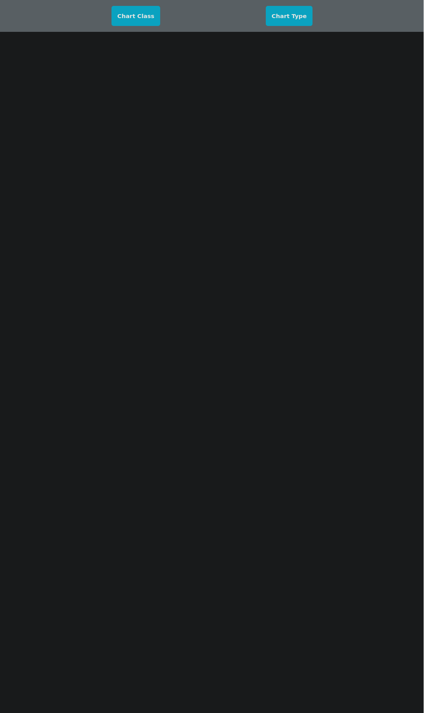
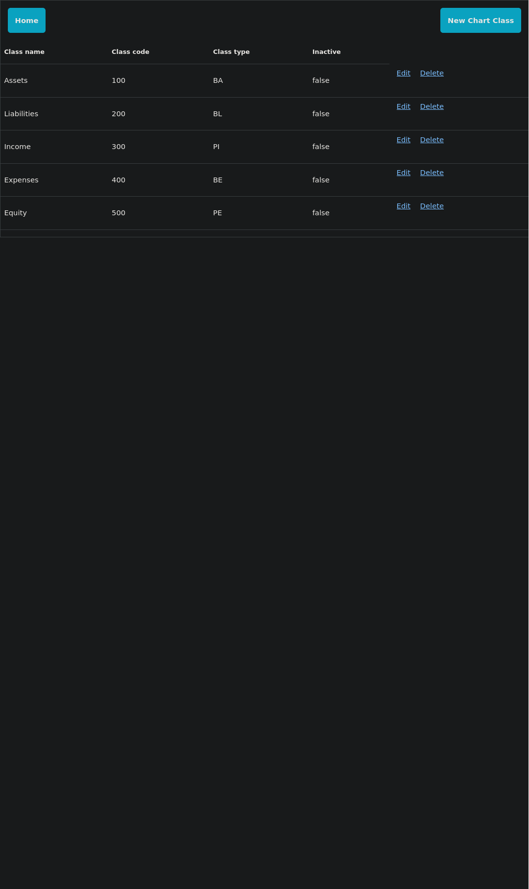
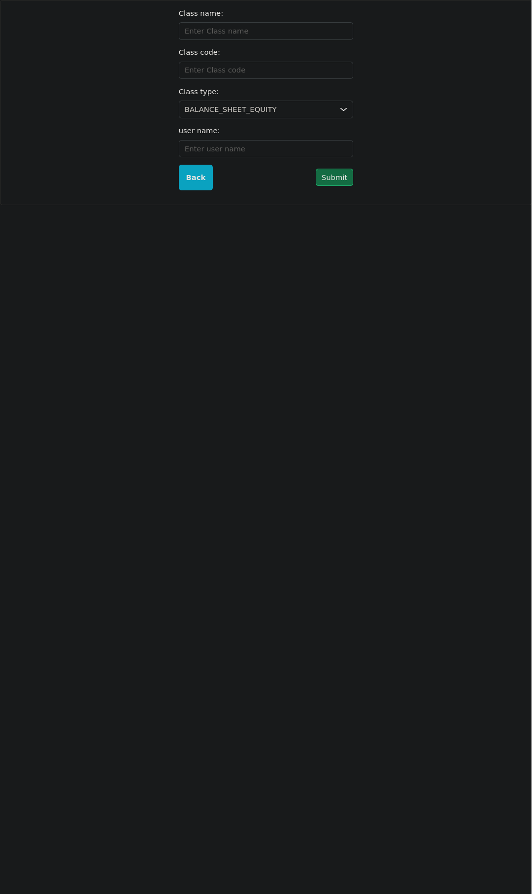
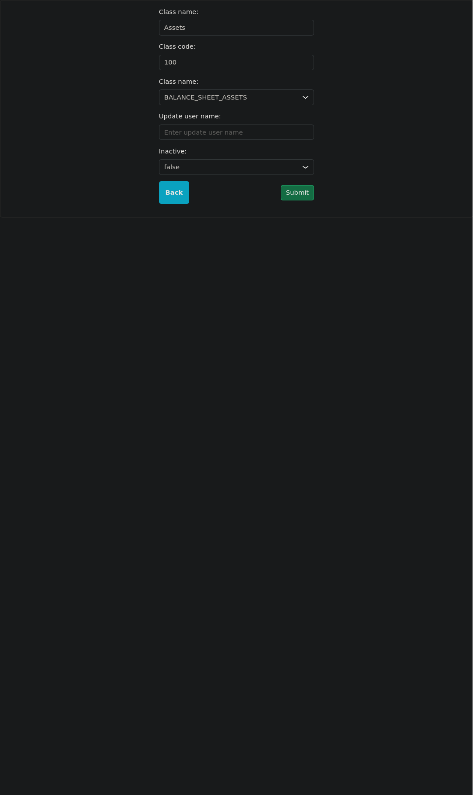
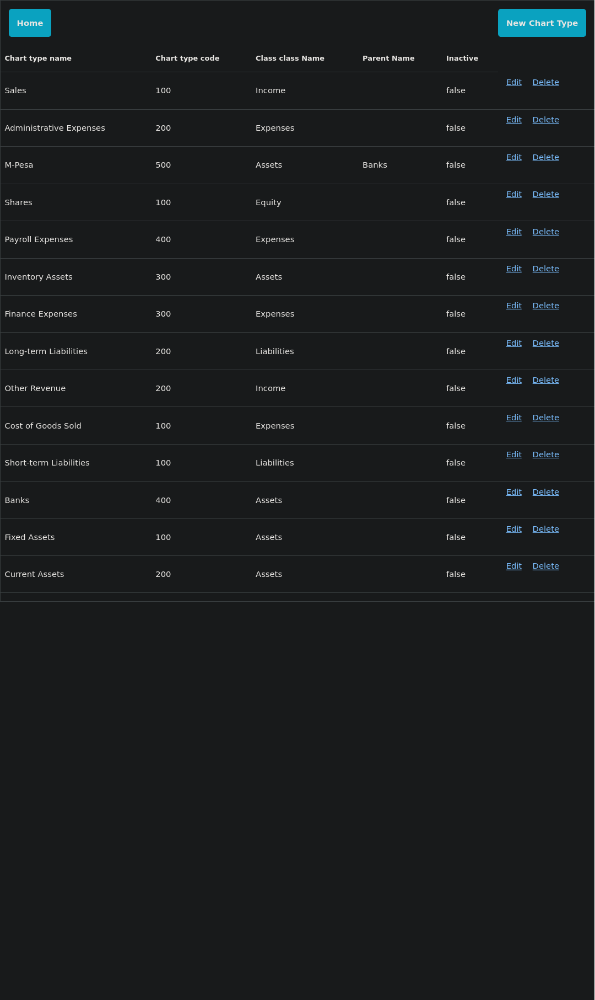
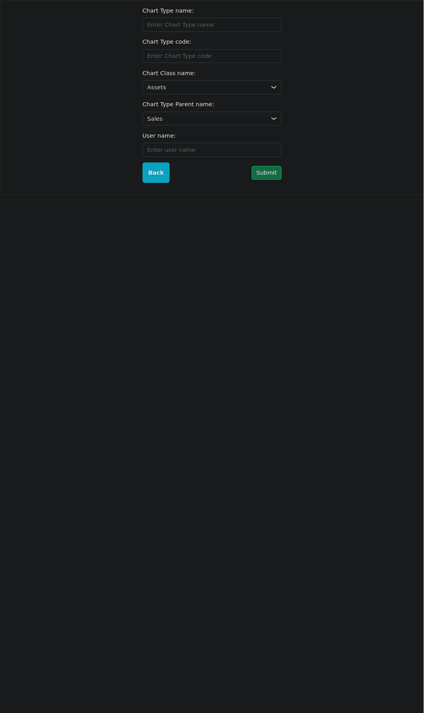
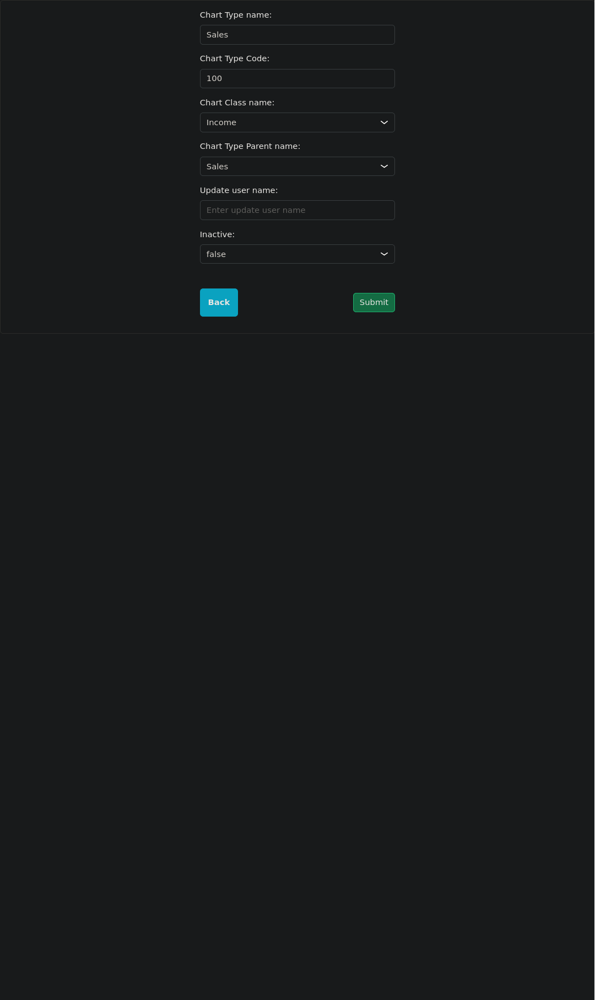

# Pesapal Interview Full-Stack CRUD Application

A project demonstrating a Spring Boot backend paired with a modern frontend (Thymleaf). The challenge is to implement a simple RDBMS whose interface is a webapp.

---

## Overview

This application is split into two parts (micro-services):

* **Backend**: Spring Boot REST API responsible for business logic and persistence.
* **Frontend**: A separate Spring Boot microservice using Thymeleaf for server-side rendered UI.


---

## Architecture

The system is composed of two independent Spring Boot microservices:

* **Backend Service**: Exposes REST APIs, handles business logic and persistence.
* **Frontend Service**: Renders HTML using Thymeleaf and communicates with the backend exclusively via REST.

```
Browser ──▶ Frontend Service (Spring Boot + Thymeleaf)
                  │
                  ▼
            REST API (Backend Service)
                  │
                  ▼
               Database


```

---

## Tech Stack

### Backend
- Java 25
- Spring Boot
- Spring Web
- Spring Data JPA
- Maven
- Docker - PostgreSQL and PGBouncer
- Flyway

### Frontend
- Java 25
- Thymeleaf
- HTML5 
- Bootstrap CSS - imported via CDN

---

## Project Structure

```

pesapal/
│
├──pesapal-interview-backend/
│   ├── src/main/java/
│   ├── src/main/resources/
│   │    │── db.migrations/
│   │    │      │── V1__init.sql       # Chart Type and Chart Class Tables creation scripts
│   │    │      └─ V2__setup.sql      # Sample Chart Type and Chart Class Tables data insert scripts 
│   │    └── application.yaml   
│   └── pom.xml
│
├── pesapal-interview-frontend/
│   ├── src/main/java/
│   ├── src/main/resources/
│   │   ├── templates/        # Thymeleaf templates
│   │   └── application.yaml
│   └── pom.xml
│
│── README.md                 # Documentation
│
│── docker/                   # Postgres init.sql and PGBouncer configs
│
│── docker-compose.yaml       # PostgresSQL and PGBouncer services
│
└── screenshots


```

---

## Backend Service Setup

### Prerequisites

* JDK 25
* Docker

### Running the Backend Service

```bash
cd pesapal
docker compose up -d
cd pesapal-interview-backend
chmod +x ./mvnw
./mvnw spring-boot:run
```

The backend API will be available at:

```
http://localhost:8080
```

---

## Frontend Service (Thymeleaf)

The frontend is an independent Spring Boot application responsible only for rendering views.

It does **not** access the database directly. All data is retrieved from the backend service via REST calls.

### Running the Frontend Service

```bash
cd pesapal-interview-frontend
chmod +x ./mvnw
./mvnw spring-boot:run
```

The UI will be available at:

```
http://localhost:8081
```

### Templates

Thymeleaf templates are located in:

```
src/main/resources/templates
```


Controllers act as API clients: they call the backend service, populate the model, and return views.

---

## Screenshots

### Landing page



### Chart Class List



### Create chart class



### Update chart class



### Chart type List



### Create chart type



### Update chart type




> Screenshots are stored in the `screenshots/` directory and referenced directly in this README.

---

## API Example

### Sample Request

```
GET http://localhost:8080/chartClass?oid=1
Accept-Encoding: br, deflate, gzip, x-gzip
Accept: */*
```

### Sample Response

```json
[
  {
    "oid": 1,
    "className": "Assets",
    "classCode": "100",
    "classType": "BA",
    "inactive": false
  }
]
```

---

## Build for Production

Each service is built and deployed independently.

### Backend Service

```bash
cd pesapal-interview-backend
./mvnw clean package
```

### Frontend Service

```bash
cd pesapal-interview-frontend
./mvnw clean package
```

Each JAR can be deployed separately, allowing independent scaling and release cycles.

## Deployment

The respective images can be pulled from docker hub and run locally

### Backend

```bash
docker run -p 8082:8080 -e SPRING_PROFILES_ACTIVE=deployment --name pesapal-interview-backend --network pesapal_app-net  m0ckinjay/pesapal-interview:pesapal-interview-backend
```

### Frontend

```bash
docker run -p 8083:8081 -e SPRING_PROFILES_ACTIVE=deployment --name pesapal-interview-frontend --network pesapal_app-net  m0ckinjay/pesapal-interview:pesapal-interview-frontend
```

The frontend can then be accessed via the browser at 
```
http://localhost:8083
```
